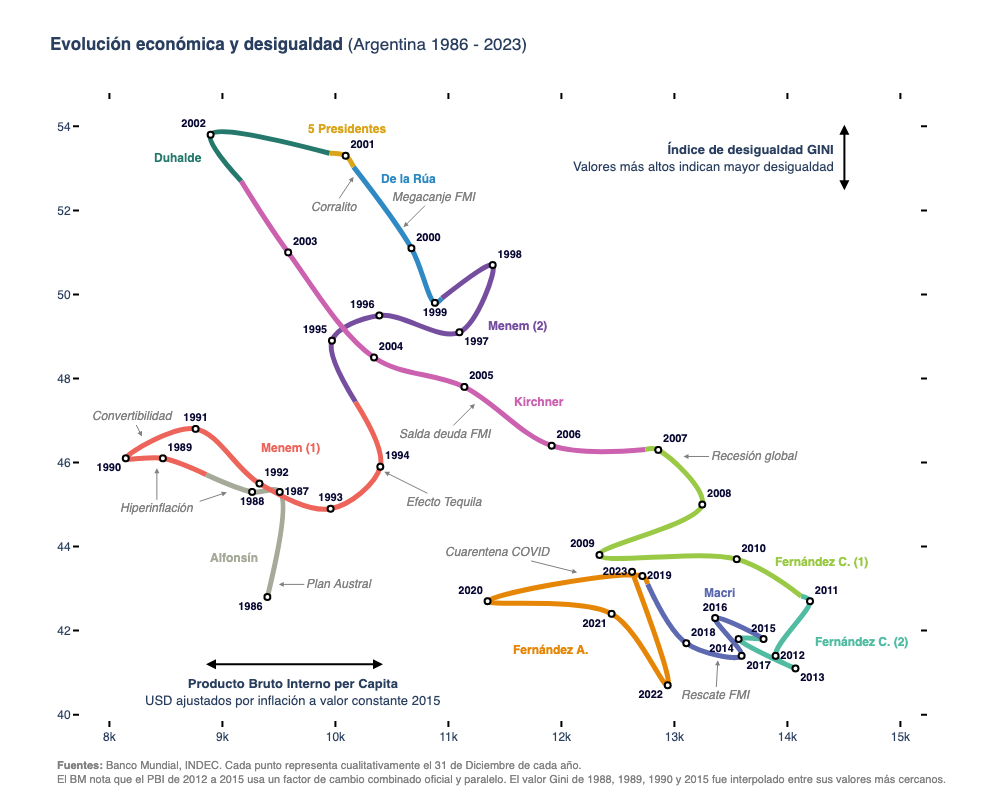

# Análisis de Evolución Económica y Desigualdad en Argentina

Este proyecto contiene un Jupyter Notebook que explora la evolución económica y la desigualdad en Argentina. Utiliza datos de fuentes confiables para visualizar tendencias importantes y proporciona insights sobre la correlación entre el PBI per cápita y el índice de Gini a lo largo de diferentes períodos presidenciales.

Basado en el [excelente análisis](https://thevizcorner.wordpress.com/2015/11/16/desigualdad-y-crecimiento-economico-en-argentina/) de Fernando Cucchietti ([@thefercook](https://twitter.com/thefercook)).

### Fuentes
Banco Mundial, INDEC. Cada punto representa cualitativamente el 31 de Diciembre de cada año.
El BM nota que el PBI de 2012 a 2015 usa un factor de cambio combinado oficial y paralelo. 
El valor Gini de 1988, 1989, 1990 y 2015 fue interpolado entre sus valores más cercanos.

## Instalación

Para ejecutar este cuaderno, necesitarás tener instalado Python y los siguientes paquetes:

- Plotly
- nbformat
- Numpy
- Pandas
- kaleido

Podés instalarlos utilizando `pip`:

```bash
pip install plotly numpy pandas nbformat kaleido
```

También hay un archivo `requirements.txt` en la raíz del proyecto. Se puede usar de esta manera:

```bash
pip install -r requirements.txt
```

Es importante tener un entorno de python medianamente actualizado

## Uso

Para ejecutar el cuaderno, abrí una terminal en el directorio del proyecto y ejecuta:

```bash
jupyter notebook
```
Luego, en la interfaz de Jupyter que se abre en tu navegador web, navegá hasta el archivo argentina_pbi_gini.ipynb y abrilo.

Alternativamente, si usás VS Code (como yo), podés instalar las extensiones necesarias para correr notebooks cómodamente en esa IDE.

Si todo sale bien, la ejecución de todas las celdas culminará con la generación de un gráfico como éste:



### Estructura de datos (Work in progress)
Los datos están en varios archivos `CSV`. Algunas reglas de estilo están en el mismo código dentro del notebook. Lo iré aprolijando y aclarando con el tiempo.

## Contribuciones
Las contribuciones a este proyecto son bienvenidas. Si tenés sugerencias o mejoras, por favor, abrí un issue o enviá un pull request.

## Licencia
Este proyecto está licenciado bajo la Licencia MIT - ver el archivo `LICENSE.md` para más detalles.


